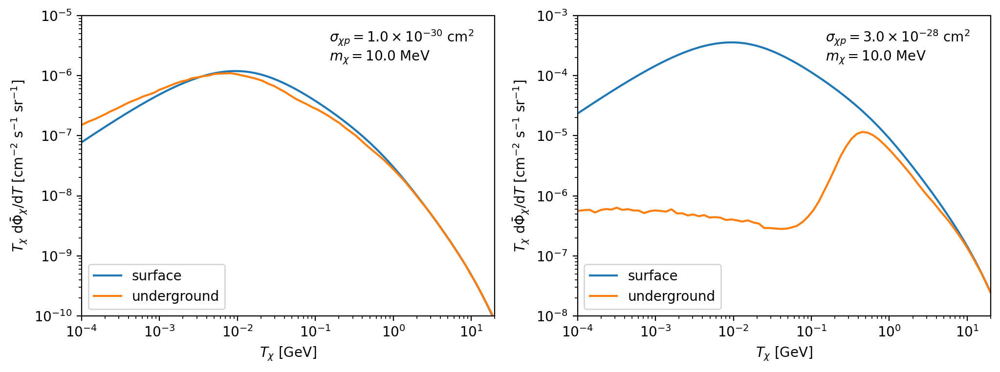

Getting Started
===============

The source code of DarkProp is released under the `MIT license <https://mit-license.org>`_
and hosted on `<http://yfzhou.itp.ac.cn/darkprop>`_.

If you use DarkProp in your publications, please cite our paper [1]_:

.. literalinclude:: ../../CITATION.bib

For bug reports, please contact Chen Xia (xiachen1996@outlook.com).

Installation
------------

.. include:: ../../README.md
   :parser: myst_parser.sphinx_
   :start-after: # Installation
   :end-before: # Uninstallation

Usage
-----

The `darkprop` application can be launched as follows,

.. code-block:: bash

   $ darkprop config.toml

or in parallel

.. code-block:: bash

   $ mpiexec -n 4 darkprop config.toml

where 4 is the number of CPU cores for parallel simulation. It can be replaced with any
other number that fits your machine. `config.toml` is the configuration file. A complete
example can be found in the `app` directory, and description of the parameters are detailed
in :doc:`input-and-output` section.

The crossing events at underground surfaces will be stored in a directory specified in the
``config.toml`` file. The reconstruction of the underground DM flux is described in the
paper [1]_ and is currently implemented separately with Python. See the `Example`_ section
below.

Example
-------

Here we give an example of the attenuation of isotropic CRDM flux.
This example can be found in the ``examples/crdm-isotropic`` directory of the source code.

First, ``cd`` into the directory and run the simulation

.. code-block:: bash

   $ mpiexec -n N darkprop config_crdm.toml

The content of the configuration file ``config_crdm.toml`` is shown below

.. literalinclude:: ../../examples/crdm-isotropic/config_crdm.toml
   :caption: DarkProp configuration file for CRDM simulation
   :language: toml

After waiting about 20 core hours, :math:`10^7` samples will be collected for each cross
section.

Then the underground flux can be reconstructed using the Python script ``analysis.py``

.. code-block:: bash

   $ python3 analysis.py

which requires Python packages, ``numpy``, ``scipy``, ``h5py``, and ``matplotlib``. The
figure ``crdm-flux.png`` as shown in :numref:`fig:crdm-flux` will be generated, which corresponds to Fig. 5 in the paper [1]_.

.. _fig:crdm-flux:

   (crdm-flux.png) CRDM fluxes at the surface and 1.4 km underground.

Other Usages
------------

For custom simulation or to implement new models, you can use the darkprop C++ library or
the darkprop python package directly.

- :doc:`darkprop-c++-library`
- :doc:`darkprop-python-package`

Building the documentation
--------------------------

To build this documentation locally, including HTML and PDF formats, one can set the
``-DBUILD_DOCS=ON`` flag at cmake configuration. The documentation is generated using
`Sphinx <https://www.sphinx-doc.org>`_, `doxygen <https://www.doxygen.nl>`_,
`breathe <https://github.com/breathe-doc/breathe>`_, and other extensions.
One way to install these dependencies is by creating a `conda <https://conda.org/>`_
environment with the ``docs/environment.yml`` file from the source,

.. code-block:: bash

   $ conda env create -f environment.yml

Then activate the environment before ``cmake --build``

.. code-block:: bash

   $ conda activate darkpropdoc

Uninstallation
--------------

.. include:: ../../README.md
   :parser: myst_parser.sphinx_
   :start-after: # Uninstallation
   :end-before: # Usage

Reference
---------

.. [1] C. Xia, Y. H. Xu, Y. F. Zhou, "Production and attenuation of cosmic-rays
       boosted dark matter". `JCAP, 2022, 02(02): 028
       <https://doi.org/10.1088/1475-7516/2022/02/028>`_,
       `arXiv: 2111.05559 <https://arxiv.org/abs/2111.05559>`_.
