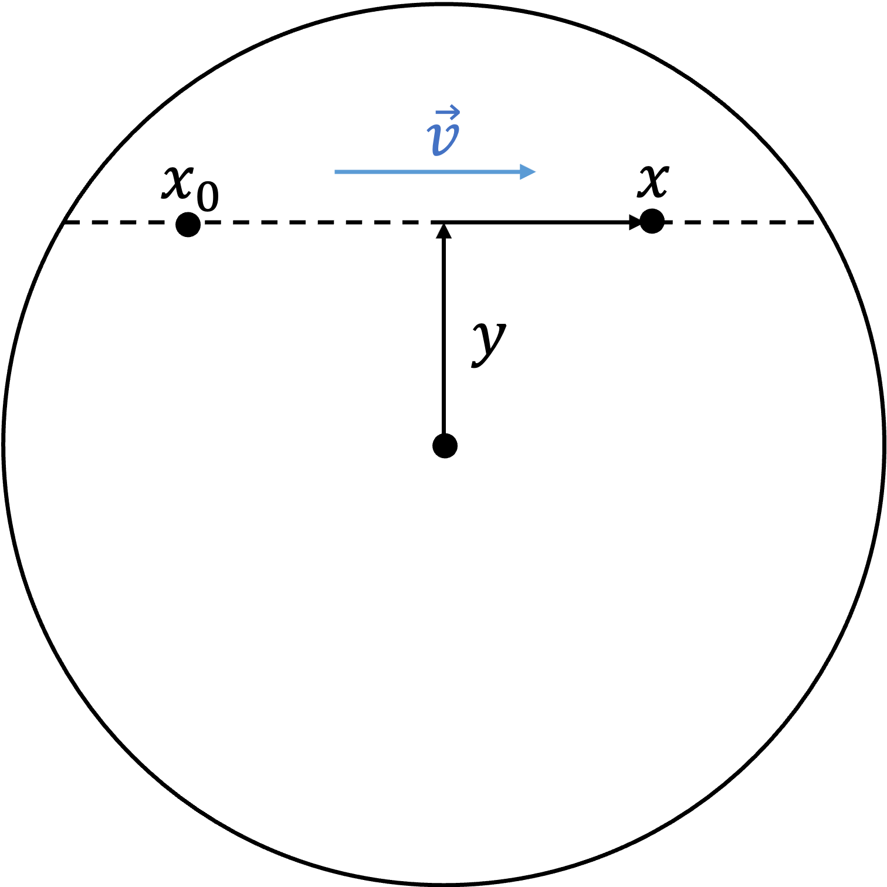

Implemented Models
==================

Medium
------

HomoEarth
^^^^^^^^^

.. doxygenclass:: darkprop::HomoEarth
   :members:

PREMEarth
^^^^^^^^^
.. doxygenclass:: darkprop::PREMEarth
   :members:

HomoElectronEarth
^^^^^^^^^^^^^^^^^
.. doxygenclass:: darkprop::HomoElectronEarth
   :members:

Sun
^^^
.. doxygenclass:: darkprop::Sun
   :members:

This Sun model is implemented only working with the :ref:`SolarDM` model which assumes
constant cross section and only couples to proton, and includes only proton and
:math:`{}^4\rm He`. So the free path equation (:eq:`eq:sample_free_path`) can be written as

.. math::
   \sigma_{\chi p} \int_0^L (n_p + 4 n_{\rm He}) \mathrm{d}l = -\ln\xi,
   :label: eq:sample_free_path_sun

where :math:`\sigma_{\chi p}` is DM-proton scattering cross section, :math:`n_p`
(:math:`n_{\rm He}`) is the number density of proton (:math:`{}^4\rm He`), and
:math:`1 - \xi` is replaced with :math:`\xi` since they have the same distribution. Note
that the factor of 4 comes from coherent scattering.
Using the reasonable approximation that the density of the Sun is isotropic, we use the
coordinates :math:`(x, y)` as shown in :numref:`fig:sun-xy`.

.. _fig:sun-xy:

   The coordinates :math:`(x, y)` for the isotropic Sun.

The direction of :math:`x` aligns with the velocity of the particle. The radius has been
normalized to 1. So :math:`y` ranges in :math:`(0, 1)` and :math:`x` ranges in
:math:`(-\sqrt{1 - y^2}, \sqrt{1 - y^2})`. We further define the normalized density
integral

.. math::
   z(y, x) \equiv \frac{\int_{-\sqrt{1-y^2}}^{x} (n_p + 4 n_{\rm He}) \mathrm{d}x'}
                  {\int_{-\sqrt{1-y^2}}^{\sqrt{1-y^2}} (n_p + 4 n_{\rm He}) \mathrm{d}x'}.
   :label: eq:sun_density_integral

Thus :math:`0 \leq z \leq 1`. Now suppose the particle starts at :math:`x_0`,
:eq:`eq:sample_free_path_sun` can be solved as follows

.. math::
   z(y, x) = z(y, x_0) + \frac{\ln\xi}{\sigma_{\chi p} R_\odot z(\sqrt{1 + y^2}, y)},

where :math:`R_\odot` is the radius of the Sun. Then :math:`x` is solved with the inverse
of :math:`z`, :math:`x = x(y, z)`, and the free path is :math:`L = (x - x_0) R_\odot`.

Particle
--------

SIDM
^^^^
.. doxygenclass:: darkprop::SIDM
   :members:

SIHelmDM
^^^^^^^^
.. doxygenclass:: darkprop::SIHelmDM
   :members:

DMElectron
^^^^^^^^^^
.. doxygenclass:: darkprop::DMElectron
   :members:

SolarDM
^^^^^^^
.. doxygenclass:: darkprop::SolarDM
   :members:
